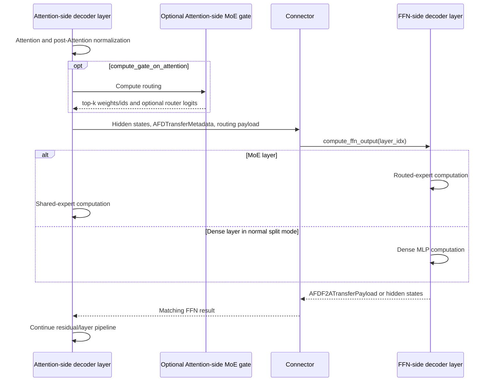

# Model integration

## Purpose and boundary

This document owns model registration, role-aware construction and weight
loading, forward-context metadata access, and model-side AFD execution. Worker
lifecycle and connector transport implementations remain outside this module.

## Ownership and dependency direction

Model integration consumes plugin configuration, connector payload contracts,
and platform mechanisms. It must not reach into concrete worker instances or
make a backend-specific worker class the shared model API.

## Implementation evidence

| Area | Source | Focused validation |
| --- | --- | --- |
| Registration map | [`afd_plugin/__init__.py`](../../../afd_plugin/__init__.py) | [`test_package.py`](../../../tests/unit/package/test_package.py) |
| Role-aware model and weight loading | [`deepseek_v2.py`](../../../afd_plugin/model_executor/models/deepseek_v2.py) | [`test_forward_context.py`](../../../tests/unit/model_executor/models/test_forward_context.py), model and accuracy E2E suites |
| DeepSeek V4 CUDA role boundary | [`deepseek_v4.py`](../../../afd_plugin/model_executor/models/deepseek_v4.py) | [`test_deepseek_v4_construction.py`](../../../tests/unit/model_executor/models/test_deepseek_v4_construction.py), [`test_deepseek_v4_proxy.py`](../../../tests/unit/model_executor/models/test_deepseek_v4_proxy.py), [`test_deepseek_v4_weight_policy.py`](../../../tests/unit/model_executor/models/test_deepseek_v4_weight_policy.py) |
| DeepSeek V4 Ascend Hash-id boundary | [`npu/deepseek_v4.py`](../../../afd_plugin/model_executor/models/npu/deepseek_v4.py), [`npu/deepseek_v4_attention_gate.py`](../../../afd_plugin/model_executor/models/npu/deepseek_v4_attention_gate.py) | [`test_deepseek_v4_hash_ids.py`](../../../tests/unit/model_executor/test_deepseek_v4_hash_ids.py), [`test_deepseek_v4_npu_weight_roles.py`](../../../tests/unit/model_executor/test_deepseek_v4_npu_weight_roles.py), ids-mode cases in [`test_camp2p_token_ids.py`](../../../tests/unit/connectors/test_camp2p_token_ids.py) |
| Qwen3 MoE role-aware model and weight loading | [`qwen3_moe.py`](../../../afd_plugin/model_executor/models/qwen3_moe.py) | [`test_qwen3_moe_construction.py`](../../../tests/unit/model_executor/models/test_qwen3_moe_construction.py), [`test_qwen3_moe_weight_policy.py`](../../../tests/unit/model_executor/models/test_qwen3_moe_weight_policy.py) |
| Registered Attention MoE runners | [`remote_moe.py`](../../../afd_plugin/model_executor/remote_moe.py) | [`test_remote_moe.py`](../../../tests/unit/model_executor/test_remote_moe.py), DeepSeek construction/proxy/weight-policy tests |
| CUDA remote-experts boundary | [`deepseek_v2.py`](../../../afd_plugin/model_executor/models/deepseek_v2.py), [`gpu/p2p.py`](../../../afd_plugin/connectors/gpu/p2p.py) | [`test_p2p_experts_contract.py`](../../../tests/unit/connectors/test_p2p_experts_contract.py), [`test_deepseek_v2_proxy.py`](../../../tests/unit/model_executor/models/test_deepseek_v2_proxy.py) |
| Forward-context adapter | [`forward_context.py`](../../../afd_plugin/model_executor/models/forward_context.py) | [`test_forward_context.py`](../../../tests/unit/model_executor/models/test_forward_context.py) |
| NPU Async CAM stage planning | [`npu/async_cam_ubatching.py`](../../../afd_plugin/model_executor/npu/async_cam_ubatching.py) | [`test_async_cam_ubatching.py`](../../../tests/unit/model_executor/test_async_cam_ubatching.py) |
| Ascend Attention-side gate | [`npu/deepseek_v2_attention_gate.py`](../../../afd_plugin/model_executor/models/npu/deepseek_v2_attention_gate.py) | Attention-gate unit cases in [`test_forward_context.py`](../../../tests/unit/model_executor/models/test_forward_context.py) |
| Ascend CAM layout and execution sidecar | [`npu/async_cam_layout.py`](../../../afd_plugin/model_executor/models/npu/async_cam_layout.py) | [`test_async_cam_layout.py`](../../../tests/unit/model_executor/test_async_cam_layout.py) |
| DeepSeek Ascend stage metadata ownership | [`npu/deepseek_attention_metadata.py`](../../../afd_plugin/model_executor/models/npu/deepseek_attention_metadata.py) | [`test_deepseek_attention_metadata.py`](../../../tests/unit/model_executor/test_deepseek_attention_metadata.py) |
| Ascend CAM orchestration | [`npu/deepseek_v2_async_cam_forward.py`](../../../afd_plugin/model_executor/models/npu/deepseek_v2_async_cam_forward.py) | Async/ubatch unit cases and [`test_async_cam_npu.py`](../../../tests/e2e/models/deepseek_v2_lite/test_async_cam_npu.py) |

## Model registration

`register_afd()` leaves vLLM's native architecture lookups unchanged and
registers lazy AFD wrapper paths under `AFD`-prefixed aliases.

| Checkpoint architecture | AFD registry alias | Registered AFD class |
| --- | --- | --- |
| `DeepseekForCausalLM` | `AFDDeepseekForCausalLM` | `AFDDeepseekForCausalLM` |
| `DeepseekV2ForCausalLM` | `AFDDeepseekV2ForCausalLM` | `AFDDeepseekV2ForCausalLM` |
| `DeepseekV3ForCausalLM` | `AFDDeepseekV3ForCausalLM` | `AFDDeepseekV3ForCausalLM` |
| `DeepseekV32ForCausalLM` | `AFDDeepseekV32ForCausalLM` | `AFDDeepseekV3ForCausalLM` |
| `DeepseekV4ForCausalLM` | `AFDDeepseekV4ForCausalLM` | `AFDDeepseekV4ForCausalLM` |
| `GlmMoeDsaForCausalLM` | `AFDGlmMoeDsaForCausalLM` | `AFDGlmMoeDsaForCausalLM` |
| `Qwen3MoeForCausalLM` | `AFDQwen3MoeForCausalLM` | `AFDQwen3MoeForCausalLM` |
| `Qwen3_5MoeForConditionalGeneration` | `AFDQwen3_5MoeForConditionalGeneration` | `AFDQwen3_5MoeForConditionalGeneration` |

Only AFD workers switch their worker-local model configuration to the matching
alias before constructing the AFD model runner. Non-AFD workers keep the
checkpoint architecture and resolve to vLLM's native model class.

The DeepSeek, DeepSeek V2/V3/V3.2, and GLM aliases share the DeepSeek
V2-derived implementation. DeepSeek V4, Qwen3 MoE, and Qwen3.5/3.6 each have a
separate wrapper around their matching native architecture. These aliases
express known compatible architecture families; they do not make any wrapper
a generic MoE model API.

## Role-aware module construction

Non-AFD workers use the pinned vLLM model implementation directly. When an AFD
worker selects an AFD alias, `AFDDeepseekV2DecoderLayer` constructs only the
components needed for the selected role while retaining layer normalization
needed by the split execution.

| Layer/component | Attention role | FFN role |
| --- | --- | --- |
| Attention module and KV-facing computation | Constructed and executed. | Not constructed. |
| MoE with `compute_gate_on_attention=false` | CUDA P2P and NPU CAMP2p use the common native MoE shell and remote runner with no local MoE parameters. | Native gate and experts are constructed and executed from connector input. |
| MoE with `compute_gate_on_attention=true` | The same MoE shell retains the local gate and injects a registered CUDA external-routing or NPU CAM routing runner. CAM also retains its Attention-owned shared MLP. | Expert MLP is constructed and consumes transferred router logits or routed payloads without rerunning the gate. |
| Dense MLP, normal mode | Not constructed; output is sent after post-Attention normalization. | Constructed and executed from connector input. |
| Dense MLP with `compute_gate_on_attention=true` | Constructed and executed locally because there is no routed MoE handoff. | Not constructed and a dense-layer FFN compute request is rejected. |
| Embedding, final norm, pipeline placeholders | Created according to the pinned pipeline-rank rules. | Same wrapper lifecycle rules; only role-required parameters are loaded. |

CUDA MoE always splits at the remote-experts boundary while preserving native
`DeepseekV2MoE.forward`. With gate-on-FFN, the runner asks FFN to run its native
internal-router MoE. With gate-on-Attention, Attention runs the native gate and
FFN executes its external-router experts path. CUDA Attention-side remote
experts currently reject EPLB. The NPU gate helper supports unquantized and
Ascend W8A8 MoE expert computation; unsupported devices or quantization fail
explicitly.

The full AFD model remains decorated with vLLM's compile support. Backend-only
helpers are imported inside the NPU path so CUDA model import does not require
vLLM-Ascend.

### Registered Attention MoE runners on vLLM 0.26

All supported DeepSeek V2-family Attention MoE paths construct
`AFDDeepseekV2RemoteExpertsMoE`, which inherits native MoE forward.
`AFDRemoteMoERunner.create` accepts model routing parameters, the gate
module and shared-expert count. It selects the registered device/connector/gate
combination, validates remote constraints, and constructs the runner through
the live native `FusedMoE` factory. It owns no-weight expert injection, unit
descriptor parallelism and disabled local expert processing. Native per-config
layer registration still runs. There is no connector-specific `self.mlp`
subclass or `use_remote_moe_runner` switch.

Registration and construction are class methods on `AFDRemoteMoERunner`; there
is no separate factory class. `create` resolves the shared lazy registry
directly. The native constructor and instance forward keep their existing
contracts. The no-weight method, expert descriptor and shared exchange function
remain separate because they serve distinct native lifecycle and transport
callers.

The registered runner's `get_factory_kwargs` supplies its native gate binding
and constructor arguments. The synchronous runners use neither; CAM binds the
Attention gate and packages `mix_placement` and the shared-expert count. Model
code supplies routing semantics and constructs its gate/shared modules, without
selecting runner classes or assembling backend `runner_args`. No extra policy
object or version-specific compatibility layer is introduced.

| Connector / gate placement | Runner |
| --- | --- |
| CUDA P2P / gate on FFN | `AFDRemoteMoERunner` |
| NPU CAMP2p / gate on FFN | Same `AFDRemoteMoERunner` |
| CUDA P2P / gate on Attention | `AFDExternalRoutingMoERunner` |
| NPU CAMAsync / gate on Attention | `AFDAttentionGateMoERunner` |

The synchronous runner returns the completed FFN result without local routing,
padding, scaling or reduction. Its external-routing subclass changes only the
internal-router property, allowing native model forward to compute and send
CUDA router logits. The common `remote_ffn_forward` preserves the existing
send/DBO-yield/receive sequence and live forward context.

The NPU runner owns its gate and calls Ascend `select_experts` with routing
fields from the factory-created expert descriptor. Its configured scaling
factor is folded into top-k weights only for mixed placement, preserving the
existing FFN scaling contract. The old model-owned `compute_gate_topk` mapping
and `GateOnlyRemoteMoE` are removed. The regular, profile and two-stage CAM
schedules call the runner's routing method; they still own deferred receive,
layout restoration and per-stage shared outputs. They bypass `mlp.forward`.
CAM shared weights remain on Attention with their existing checkpoint paths
and replicated/SP computation contract.

`AFDRemoteMoEMethod` creates no routed expert weights, leaves dimensions
unpadded and retains the native post-load no-op. Complete native constructors
and registration still run. The descriptor uses unit TP/DP/PCP dimensions;
actual model and FFN topology remain unchanged. Attention-local EPLB, redundant
experts and expert capture are rejected by the construction entry before the
native factory runs. NPU construction also calls its backend validation for
Ascend EPLB and expert maps. These checks apply to direct factory callers as
well as DeepSeek. The model retains its existing sequence-parallel MoE
rejection. No local expert kernel is prepared.

The pinned Ascend factory honors explicit runner and expert classes. Its
`AscendMoERunner` initializer would replace the no-weight method and initialize
local expert execution. Both synchronous connectors therefore share the common
runner without a mixin or separate backend subclass. CAM reuses the Ascend
selector directly because the pinned Ascend runner has no routing-only forward
that avoids expert initialization/computation.

Qwen3.5/3.6 also constructs its remote experts through
`AFDRemoteMoERunner.create`, reusing `AFDRemoteMoERunner` and native
registration. The old `AFDAttentionFusedMoE` production class is removed.
`RemoteFFNProxy` remains in the DeepSeek adapter and delegates to the common
exchange helper; moving this dense/legacy proxy is deferred. Qwen3 MoE and
NPU V4 keep their existing imports and boundaries, including token IDs and
routing kwargs. No `remote_ffn.py` module is introduced.
The new experts-boundary runners reject non-null IDs before gate/communication.
FFN driver generalization from RFC #225 Phase 2 is not part of this change.

These hooks target vLLM 0.26.0
(`568afb3a13806beb53bb2e6bd518269357b237c0`) and vLLM-Ascend
`80d8c194f7584b17fe08065ea99a130916f6b0e7`. Upgrades must recheck the actual
factory composition, public forward, routing and post-load contracts.
vLLM 0.30 moves kernel preparation into the method lifecycle, and newer Ascend
factories compose custom expert classes. No version dispatcher or unused
compatibility API is added for those future changes.

GPU tests and profiling must run under the system `gpu run` scheduler. Use
its assigned devices for all child services; do not start unreserved GPU work.

The matrix below records validation before the factory-construction follow-up:

| Check | CUDA / common runtime | NPU |
| --- | --- | --- |
| Native 0.26 construction, registration, post-load and transport contracts | Passed on real vLLM 0.26 | Requires Ascend runtime |
| Native FFN BF16 loopback, tokens 1 and 7 | Passed for both CUDA gate placements: shared experts, scale 2.5, exact BF16 equality | Requires NPU runtime/hardware |
| `baseline-graph` | Passed: GSM8K 2/7, eight-shot; graph capture and shutdown passed | Not run: no NPU runtime/hardware |
| `afd-eager-2a2f` | Passed: GSM8K 2/7, eight-shot; shutdown passed | Not run: no NPU runtime/hardware |
| `afd-graph-2a2f` | Passed: GSM8K 2/7, eight-shot; FULL_DECODE_ONLY capture 0.05 GiB | Not run: no NPU runtime/hardware |
| `afd-graph-dbo-2a2f` | Passed: GSM8K 7/24; 386 live two-ubatch steps with FULL replay | Not run: no NPU runtime/hardware |
| `afd-eager-2a1f` | Passed: GSM8K 2/7, eight-shot; asymmetric topology and shutdown passed | Not run: no NPU runtime/hardware |
| GPU `afd-v2` eager/graph, 1A1F/DP2/TP2 | All six passed: GSM8K 2/7 each; all three graph cases completed FULL capture | Outside the GPU V2 matrix |
| Warm loopback CUDA activities and exchange counts | Identical: 18 CUDA activities and one send/yield/receive per call | Not measured |
| Before/after load memory, physical latency and throughput | Not measured | Not measured |

Before that follow-up, the scheduled model, connector, DBO, FFN and graph regression passed
550 cases, skipped 61 requiring Ascend dependencies, and deselected four NPU
cases. Focused runner validation also passed 20 cases with three NPU runtime
skips. CAM selector contracts use the real native factory/descriptor with a
stubbed Ascend primitive, not NPU hardware. Compilation and all applicable
repository pre-commit checks passed. The final warm loopback retained exact
BF16 equality and identical CUDA activities, exchange counts and synchronization.

The factory-construction follow-up passed 135 focused runner, DeepSeek
construction, weight-policy and context tests under `gpu run`; four NPU cases
were deselected. All four registered configurations construct real native
runners, with Ascend configuration/selector dependencies stubbed in CPU
contract tests. Direct factory calls reject incompatible local capabilities
before native construction. The CUDA BF16 loopback passed again for both gate
placements, tokens 1 and 7, shared experts and scale 2.5. Compilation and
repository pre-commit checks passed. The full physical E2E/profiling matrix
above was not repeated for this construction-only follow-up.

The GPU loopback is eager-only and does not validate physical transport,
full-model accuracy or graph replay. Before/after full-model logits, load-memory
and physical throughput parity have not been measured. V2 graph runs completed
FULL_DECODE_ONLY capture and generation; their logs do not provide per-step
replay counts. All eleven GPU E2E nodes, including the native baseline, passed
with process cleanup. V2 used isolated API/AFD ports through a temporary pytest
harness override; thresholds and production code were unchanged.

### DeepSeek V4 CUDA boundary

`AFDDeepseekV4ForCausalLM` wraps vLLM's NVIDIA DeepSeek V4 implementation and
splits immediately around each decoder FFN. Attention owns Attention, all mHC
residual-stream state and normalization, embeddings/finalization, auxiliary
CUDA streams, and sparse-index buffers. It sends only the normalized
two-dimensional FFN activation plus token-aligned `input_ids` through a
parameter-free `RemoteDeepseekV4FFN`. FFN owns the complete native
`DeepseekV4MoE`, including its hash router, and returns the FFN activation.

Role-aware weight filtering keeps layer `.ffn` parameters on FFN and all
other layer-local and mHC head parameters on Attention; common non-layer paths
remain available to both roles for the native loader lifecycle. The adapter is
CUDA-only and requires synchronous `P2pNcclAFDConnector`,
`compute_gate_on_attention=false`, and pipeline-parallel size 1. It rejects
sequence-parallel MoE, EPLB, and the `deep_gemm_mega_moe` backend. The P2P
connector validates one-dimensional `torch.int32` input IDs and preallocates
their receive buffers for graph execution. This boundary currently has
focused unit coverage but no repository model or accuracy E2E case.

### Qwen3 MoE CUDA boundary

`AFDQwen3MoeModel` uses the native `decoder_layer_type` injection hook. The
Attention role constructs native Qwen Attention and normalization modules and
uses a parameter-free `RemoteFFNProxy`; the FFN role constructs the complete
native dense MLP or `Qwen3MoeSparseMoeBlock`. Native forward order, FusedMoE,
packed parameter mapping, quantization paths, and weight loading remain owned
by vLLM. Checkpoint weights are filtered once by layer-stage path before the
native loader consumes them.

This path is CUDA-only and requires `compute_gate_on_attention=false`. It fails
during construction for sequence-parallel MoE, EPLB, pipeline parallelism,
speculative decoding, LoRA, or NPU.

### Qwen3.5/3.6 MoE CUDA boundary

`AFDQwen3_5MoeForConditionalGeneration` is a distinct wrapper around vLLM's
native hybrid Qwen3.5/3.6 architecture. Attention owns embeddings, norms, and
linear/full-attention state, then sends hidden states only. FFN owns the native
gate, routed experts, shared expert, and shared-expert gate.

The Attention MoE shell now passes native Qwen routing parameters to
`AFDRemoteMoERunner.create`. It receives the same registered native
runner used by DeepSeek, without importing the DeepSeek model adapter or
maintaining a second MoE forward proxy. `Qwen3NextSparseMoeBlock.forward` stays
inherited, and the shell constructor matches the upstream signature. Expert
weights remain on FFN; the factory registers the empty Attention descriptor
at the native `.mlp.experts` prefix.

This path is CUDA-only, text-only, and requires `--language-model-only`,
`compute_gate_on_attention=false`, and `pipeline_parallel_size=1`. It rejects
multimodal execution, sequence-parallel MoE, EPLB, speculative decoding, and
LoRA before language-model construction; NPU model-config resolution fails
before model loading. Attention-side router transport, DBO, DP/EP/PP, async
communication, multi-node, quantization, and performance are outside this
adapter's current contract.

The proxy-removal follow-up passed 59 CPU construction/communication tests with
accelerator devices hidden and five GPU/NPU cases deselected. Compilation and
repository pre-commit checks passed. GPU validation is deferred at the user's
request; earlier DeepSeek GPU results do not constitute Qwen hardware acceptance.
The previous proxy is retained only as a frozen numerical-test baseline; that
updated hardware test has not been run in this follow-up.

## Forward-context contract

The runner installs `AFDForwardContextMetadata` in
`ForwardContext.additional_kwargs["afd_metadata"]`. Model code reads only that
key through `get_afd_metadata_from_forward_context()`; it does not inspect an
ad-hoc `ForwardContext.afd_metadata` attribute. The current metadata supplies
stage/request/token slicing, stage count, optional transaction ID, and a live
connector reference.

Native forward-context creation can bypass an AFD model-runner call site:
V1 dummy runs do so, while V2 creates its context inside native
`execute_model()`. During those scopes, `use_afd_metadata_provider()`
temporarily wraps `vllm.forward_context.create_forward_context`, lets the
runner install the same `additional_kwargs` entry, and restores the original
function in `finally`. This is a scoped compatibility adapter, not a permanent
global provider.

Async MoE ubatching uses a second sidecar key,
`afd_async_moe_ubatch_metadata`, containing upstream Attention metadata and
plugin-owned stage descriptions. The generic adapter owns only `afd_metadata`;
the NPU sidecar and layout conversion live in `models/npu/async_cam_layout.py`,
while `model_executor/npu/async_cam_ubatching.py` contains the pure NPU execution
planner. Both the sidecar shape and the live connector reference are
**draft** while metadata ownership is discussed in
[#88](https://github.com/JiusiServe/afd-plugin/issues/88) and payload state is
split under [#105](https://github.com/JiusiServe/afd-plugin/issues/105).

## Model execution flow

In the generic split path, the Attention wrapper receives the previous FFN
result after the first local layer, executes Attention and normalization,
creates `AFDTransferMetadata` for the current layer/stage, sends hidden states,
and yields at the DBO hook when enabled. After the final layer it receives the
last FFN result and completes the model's pipeline-rank output logic.

The FFN runner calls the causal-LM wrapper's `compute_ffn_output()`, which
dispatches to the selected decoder layer. Normal mode executes that layer's
MLP. Attention-side-gate mode requires connector-produced group/routing and
quantization metadata and executes the Ascend routed-expert path. Async CAM
returns only routed output in `AFDF2ATransferPayload`; Attention owns the
native shared MLP, uses replicated weights on its local tokens, and adds
the shared result after restoring the routed token layout. Pending stages
retain separate shared tensors; failed forwards discard pending routing references.

CAM async has two model-side variants:

- the standard gate path keeps dense layers on Attention, sends only MoE
  layers with top-k payloads, and delays the matching FFN receive until it is
  needed;
- the experimental two-stage request-boundary path runs dense layers once,
  slices the MoE region by request, installs stage-specific forward context,
  pipelines send/receive across the two stages, and restores parent context
  state on exit.

Connector ordering, work items, and transport buffers remain owned by
[connector contracts](connector_contracts.md); graph and DBO mechanics remain
owned by [execution platforms](execution_platforms.md).

## Role-aware weight loading

The wrapper follows pinned vLLM mappings for stacked projections, expert
weights, speculative-layer skips, pipeline-missing parameters, KV-scale
renaming, shared-expert placement, and redundant experts. AFD adds role
filtering:

- Attention loads Attention/common parameters and skips FFN expert parameters.
  When gate-on-Attention is enabled, MoE gate weights retain the native
  `.mlp.gate` path and are also loadable on Attention, while dense MLP
  parameters remain loadable for locally executed dense layers.
- FFN loads the MLP/expert and required common parameters and skips unrelated
  Attention parameters. In gate-on-Attention mode it also skips dense MLP
  parameters because those layers execute on Attention.
- Model-specific missing, fused, redundant, and pipeline parameters retain the
  upstream skip/mapping behavior instead of being treated as AFD errors.

Any change to these filters must be compared against the pinned upstream
loader and validated on both roles. A successful load set is not evidence that
the other role can be omitted from model/accuracy E2E coverage.

## Failure and resource ownership

- Missing `afd_metadata` on an AFD path fails explicitly; an AFD model alias is
  not an implicit local-forward fallback.
- AFD paths that require a connector, top-k payload, group list, or async stage
  metadata fail when that input is missing.
- DeepSeek V4 fails when its remote boundary lacks token-aligned input IDs or
  when those IDs have the wrong shape/dtype for P2P transfer.
- Unsupported aux-hidden-state capture, unsupported device gate placement or
  gate quantization, and inconsistent shared-expert dimensions fail explicitly.
- The model owns modules, parameters, local intermediates, and layer
  computation. The runner owns forward-context installation and step
  lifecycle. The connector owns communication resources and transfer state.
- A connector reference in forward metadata grants call access for that
  forward only; model code does not initialize or close it.

## Candidate invariants

The following RFC candidates are non-normative while this document is draft:

- `MODEL-INV-001`: model-side AFD metadata is read from
  `ForwardContext.additional_kwargs["afd_metadata"]`.
- `MODEL-INV-002`: role-aware construction and loading omit components not
  executed by that role while preserving pinned upstream parameter mappings.
- `MODEL-INV-003`: model code owns computation only; runner lifecycle and
  connector resource lifetime do not move into the wrapper.

The live connector reference currently present in forward-context metadata is
not declared a long-term model API.

## Upstream relationship and validation requirements

Changes must be compared with the matching pinned vLLM architecture and
forward-context contract. Run model unit tests and the affected GPU/NPU model
and accuracy E2E paths; weight-loading changes require role-specific evidence.
Forward-context mutations require restoration/error-path tests, and an
architecture registration change requires package registration plus checkpoint
load evidence. A unit-only architecture such as the current DeepSeek V4 path
must not be described as hardware-validated without new E2E evidence.

## Limitations and open issues

The common metadata and transfer-state contracts remain DeepSeek-oriented.
Qwen3 MoE reuses only their existing remote-FFN boundary and does not expand
them into a generic model API. Metadata ownership and transfer state decisions
remain linked to
[#88](https://github.com/JiusiServe/afd-plugin/issues/88) and
[#105](https://github.com/JiusiServe/afd-plugin/issues/105).

The current `AFDForwardContextMetadata` shape, connector reference, async MoE
sidecar, and architecture aliases remain **draft**. They describe the working
pinned implementation and must not be used as an independent extension promise
until the linked issues and owner review are complete.
